# 단비교육 사전과제

## 개요

윙크 서비스 내에 Routine 기능을 추가하고자 합니다. 

Routine 기능이란, 매 주마다 정해진 일정에 자신이 해야할 일을 등록하고, 해당 수행여부에 대한 내용을 기록하여 관리할 수 있도록 도와주는 기 능입니다. 
Routine 기능에서는 다음과 같은 기능을 제공하고자 합니다. 

* 유저의 로그인/로그아웃 기능 
* 매 주별 해야할 일의 등록 / 수정 / 삭제 / 조회 기능 
* 일정이 지난 후 진행한 할 일들에 대한 해결여부 기록 
  * 각 할일에 대한 결과는 독립된 결과로 기록되어야 함 
  * 예시)월/수/금 할일로 등록했을 때, 특정 날짜 데이터를 조회하면 조회한 날짜에 대한 수행결과만 모두 조회가 되도록 구성

## 요구사항

1. 유저의 로그인은 email로 진행합니다. 
2. 유저의 비밀번호는 8글자 이상이며 특수문자, 숫자를 포함해야 합니다. 
3. 유저 관련 동작은 django에서 제공하는 기본 기능을 이용해서 구현합니다. 
4. 테이블은 아래의 Schema를 따라야 합니다. 
   * 각 필드별 타입은 알아서 정의해주시면 됩니다. 
5. 서버 구성은 자유롭게 하시면 됩니다.

### routine 

* routine_id (Primary Key) 
* account_id 
* title 
* category 
* [MIRACLE(기상 관련), HOMEWORK(숙제 관련)] 
* goal 
* is_alarm 
* is_deleted 
* created_at 
* modified_at 

### routine_result 

* routine_result_id (Primary Key) 
* routine_id 
* result [NOT(안함), TRY(시도), DONE(완료)] 
* is_deleted 
* created_at 
* modified_at 

### routine_day 

* day
* routine_id 
* created_at 
* modified_at

##  요청과 응답은 아래 예시를 따라야 합니다.

### Routine 생성 

```json
Request = {
     "title" : "problem solving",
     "category" : "HOMEWORK'",
     "goal": "Increase your problem-solving skills",
     "is_alarm": true,
     "days": ["MON", "WED", "FRI"]
}
Response = {
     "data": {
     	"routine_id": 1
     },
     "message": {
     	"msg": "You have successfully created the routine.",
    	"status": "ROUTINE_CREATE_OK",
     }
}
```

### Routine 목록 조회

```json
Request = {
     "account_id" : 1,
     "today" : "2022-02-14"
}
Response = {
     "data" : [{
         "goal" : "Solve 2 pages of math problems every day",
         "id" : 1,
         "result" : "NOT",
         "title" : "solve math problems"
     },
     {
         "goal" : "Solve 2 pages of english problems every day",
         "id" : 1,
         "result" : "DONE",
         "title": "solve english problems"
     }],
    "message": {
        "msg": "Routine lookup was successful.",
    	"status": "ROUTINE_LIST_OK",
    }
}
```

### Routine 단건 조회

```json
Request = {
     "account_id" : 1,
     "routine_id" : 3
}
Response = {
     "data" : {
         "goal" : "Solve 2 pages of math problems every day",
         "id" : 1,
         "result" : "NOT",
         "title" : "solve math problems",
         "days": ["MON", "WED", "FRI"]
     },
    "message": {
        "msg": "Routine lookup was successful.",
        "status": "ROUTINE_DETAIL_OK",
    }
}
```

### Routine 수정

```json
Request = {
     "routine_id" : ID to change(Optional)
     "title" : "Title to edit(Optional)"
     "category" : "category(Optional)",
     "goal" : "goal(Optional)",
     "is_alarm" : "Alarm or not(Optional)",
     "days" : set day(Optional)
}
Response = {
     "data": {
     	"routine_id": 1
     },
     "message": {
         "msg": "The routine has been modified.", 
         "status": "ROUTINE_UPDATE_OK"
     }
}
```

### Routine 삭제

```json
Request = {
    "account_id" : 1,
    "routine_id" : 1,
}
Response = {
     "data": {
     	"routine_id": 1
     },
     "message": {
         "msg": "The routine has been deleted.", 
         "status": "ROUTINE_DELETE_OK"
     }
}
```

### 제약사항

* Python, Django, DRF를 이용해 구현해 주세요 
* 유저 검증은 Session 또는 jwt를 이용해 주세요. 
* Database의 사용은 자유롭게 하시면 됩니다. 
* Restful API 구현은 자유롭게 하시면 됩니다. 
* 명시된 예시 외에 필요하다고 생각되는 API는 자유롭게 구현해 주세요. 
* 테스트 코드를 꼭 작성해 주세요.

### 평가항목

* 프로젝트의 구성을 적절히 하였는가? 
* 프로젝트 소스 코드의 구성이 가독성 있게 구성되어 있는가?
* 테스트 코드는 적절하게 구현되어 있는가? 
* 요구사항에 대한 판단이 적절하게 이루어져 있는가?

## 과제 완료

### index.html(로그인 x)

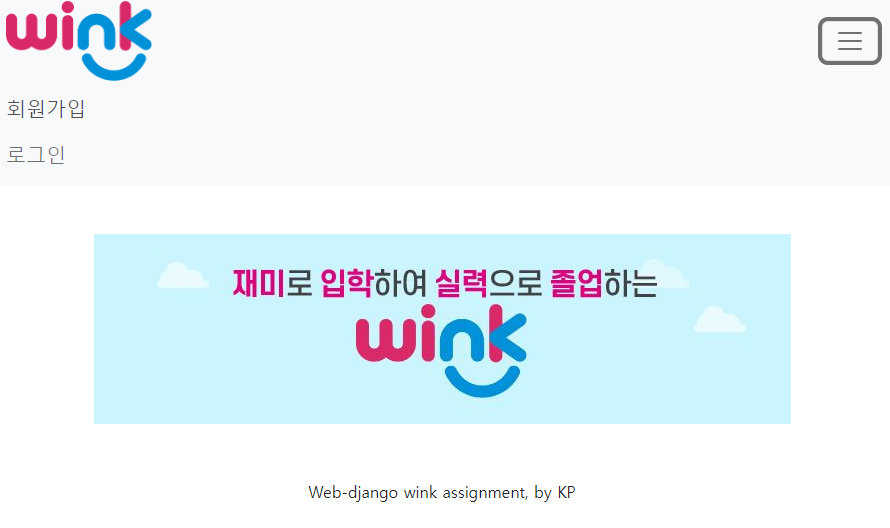

* 기본 페이지이며, 네비게이션 바를 통해 회원가입과 로그인 가능

### signup.html

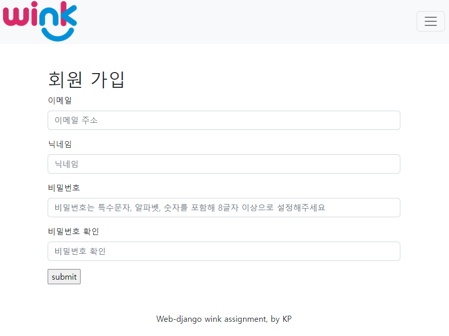

* 이메일과 닉네임, 특수문자와 알파벳 숫자를 포함한 비밀번호로 계정 생성 가능

### login.html

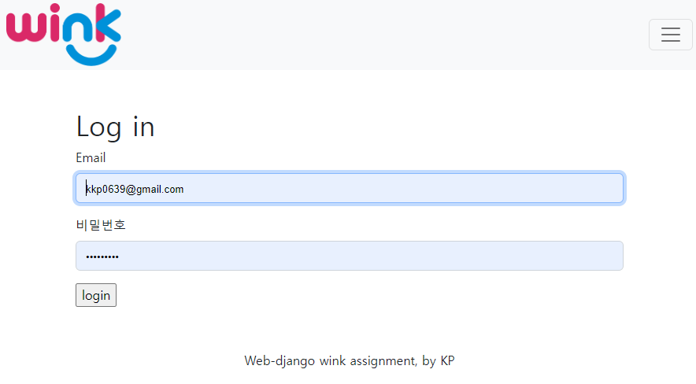

* 로그인페이지를 통해 로그인 가능

### index.html(로그인 o)

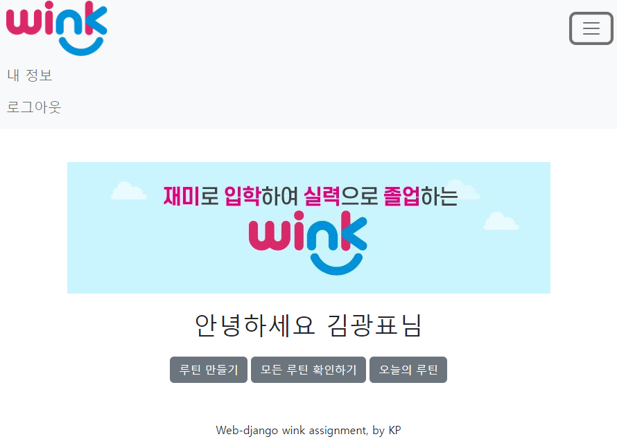

* 로그인 후에는 네비게이션 바를 통해 내 정보 확인과 로그아웃이 가능하며, 루틴 만들기, 루틴 확인하기, 오늘의 루틴 페이지로 이동하는 버튼이 생김

### profile.html

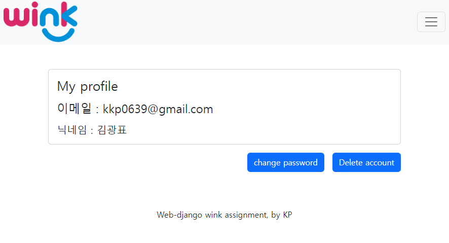

* 내 정보를 확인 가능하며, 계정삭제 및 비밀번호 변경 가능

### create

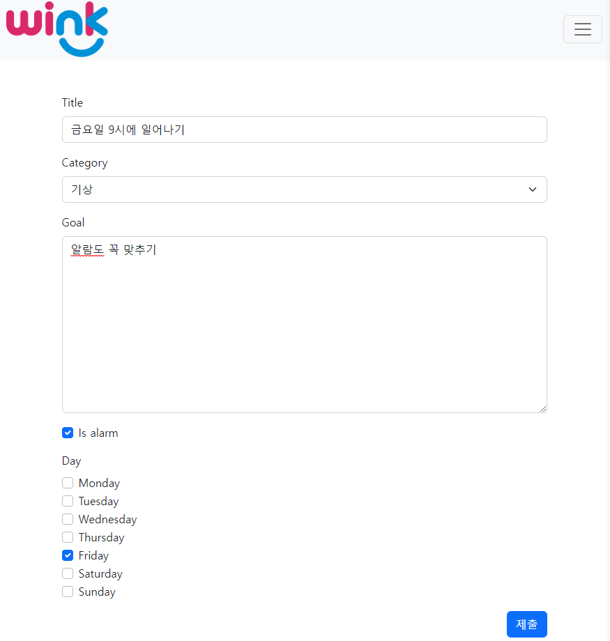

* 루틴 만들기 버튼을 통해 글을 쓸 수 있으며, 제목, 카테고리, 목표 알람여부를 설정가능함
* 이 때 아래의 요일 선택을 통해 result_day도 함께 생성. 다중 선택 가능함
* 대응되는 result도 dafault=not인 상태로 생성됨
* 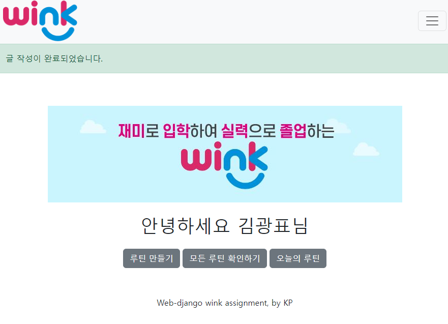
  * 글 생성 후에는 메시지가 alert됨

### read.html

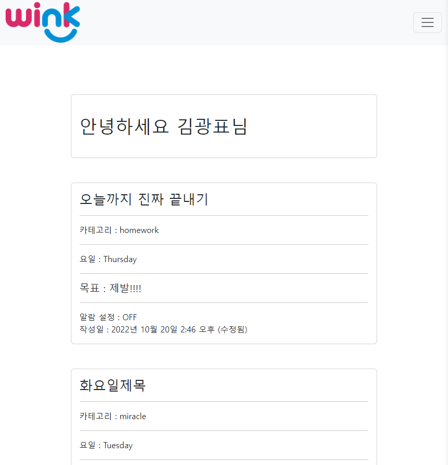

* 해당 아이디로 생성한 모든 루틴 확인 가능

### days.html

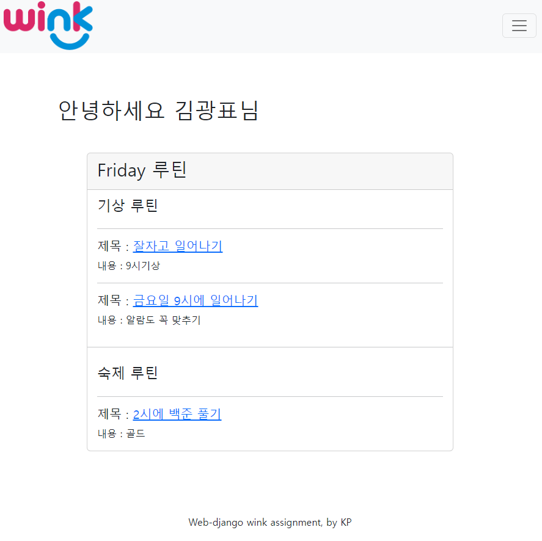

* 오늘 날짜에 해당하는 루틴만을 보여줌. 제목을 클릭해서 detail페이지로 이동 가능

### detail.html

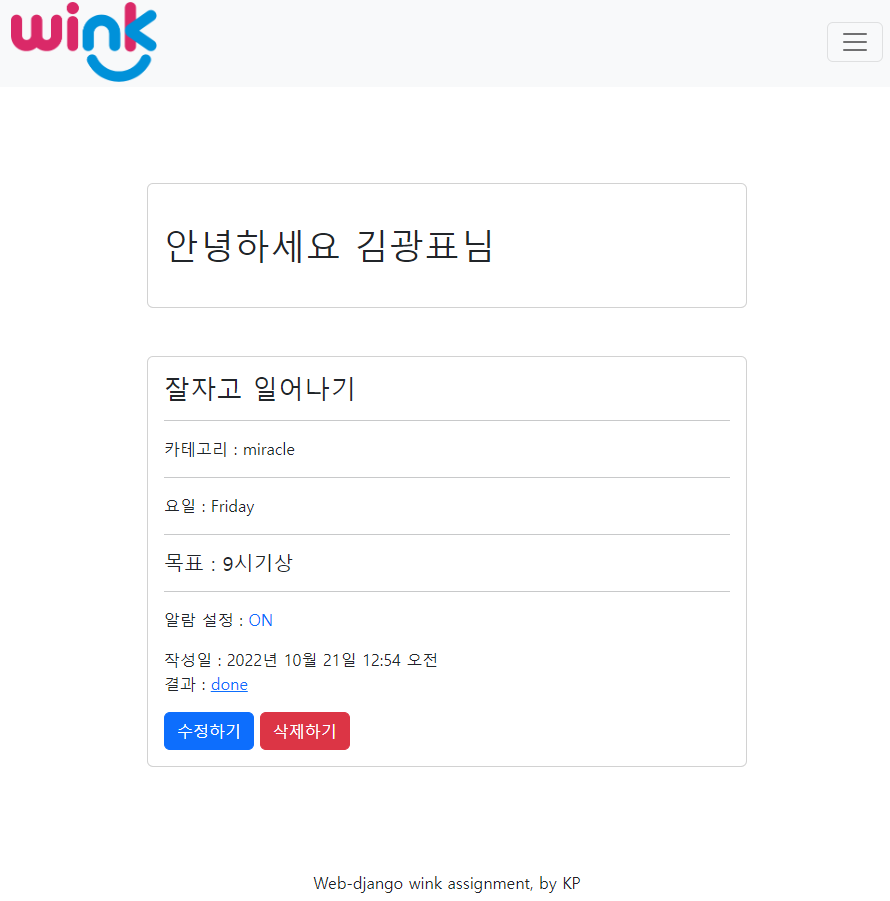

* 해당 루틴의 상세정보를 확인 가능
* 알람설정을 클릭해 on off 변경 가능
* 수정을 해서 작성일이 변경되면 (수정됨)이 붙음
* 삭제하기를 통해 is_deleted를 True로 변경 가능
  * 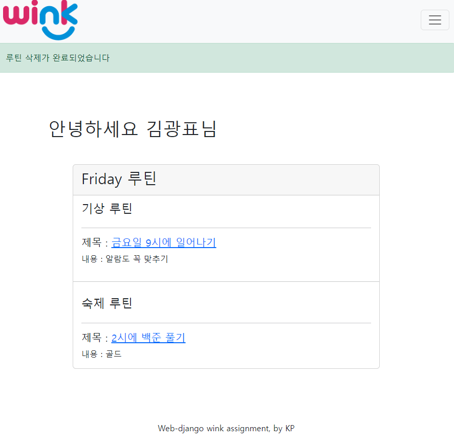
  * 삭제할 시 days페이지로 이동하며, is_deleted가 True인 루틴들은 열람 불가능해짐
* 결과를 클릭해서 결과 수정 페이지로 이동
  * 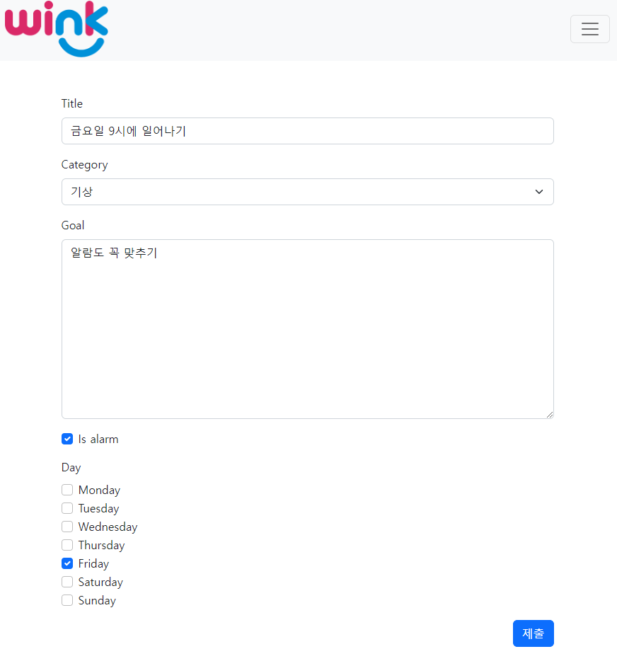
  * routine과 rotine_day 수정 가능

### result.html

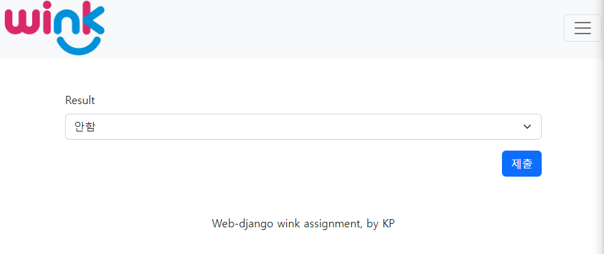

* 결과 수정 가능